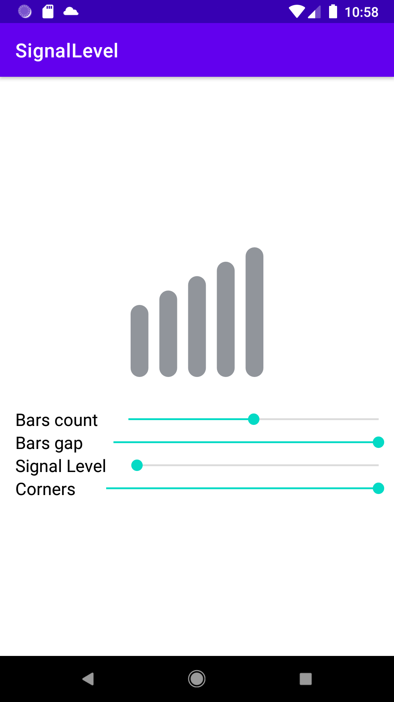
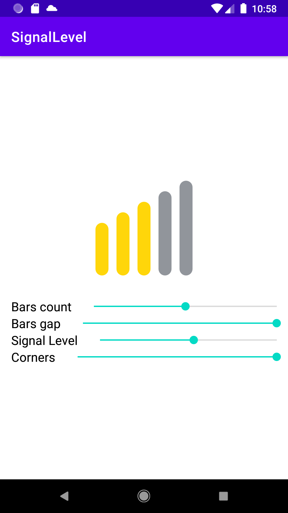
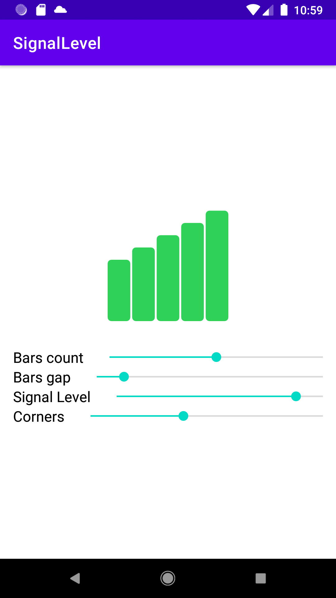

# SignalLevel

SignalLevel is an Android library for displaying signal level like control.

## Features

### Fully customizable

* Set custom amount of bars
* Set colors for low, medium and high level of signal
* Set gap between bars
* Set top and bottom corners

## Screenshots








## Quick start

**0)**

```gradle
    allprojects {
        repositories {
            ...
            maven { url 'https://jitpack.io' }
        }
    }
```

**1)** Add this library as a dependency in yours app build.gradle file

```gradle
dependencies {
  implementation 'com.github.x913:signal-level:1.0'
}
```

**2)** Add the view to your XML layout

```xml
<LinearLayout
    xmlns:app="http://schemas.android.com/apk/res-auto"
    xmlns:tools="http://schemas.android.com/tools"
    android:layout_width="match_parent"
    android:layout_height="match_parent"
    android:orientation="vertical"
    android:gravity="center"
    tools:context=".MainActivity">

    <com.github.x913.signallevel.SignalLevelView
        android:id="@+id/signal_level"
        android:layout_width="150dp"
        android:layout_height="150dp"
        app:signalBarsGap="5"
        app:signalLevel="0.8"
        app:signalBarCorners="25"
        app:signalBarsCount="5" />

</LinearLayout>
```

**3)** Optionally you can change signal level attributes from code

```kotlin
abstract class SeekBarChange : SeekBar.OnSeekBarChangeListener {
    override fun onProgressChanged(seekBar: SeekBar?, progress: Int, fromUser: Boolean) {

    }

    override fun onStartTrackingTouch(seekBar: SeekBar?) {

    }

    override fun onStopTrackingTouch(seekBar: SeekBar?) {

    }
}

class MainActivity : AppCompatActivity() {

    private lateinit var binding: ActivityMainBinding

    private val seekBarChange = object: SeekBarChange() {
        override fun onProgressChanged(seekBar: SeekBar?, progress: Int, fromUser: Boolean) {
            when(seekBar?.id) {
                R.id.bars_count -> binding.signalLevel.signalBarsCount = progress
                R.id.bars_gap -> binding.signalLevel.signalBarsGap = progress
                R.id.bars_signal_level -> binding.signalLevel.signalLevel = progress / 100f
                R.id.bars_corners -> binding.signalLevel.signalBarCorners = progress.toFloat()
            }
        }
    }

    override fun onCreate(savedInstanceState: Bundle?) {
        super.onCreate(savedInstanceState)
        binding = ActivityMainBinding.inflate(layoutInflater).also {
            setContentView(it.root)
        }

        with(binding) {
            barsCount.setOnSeekBarChangeListener(seekBarChange)
            barsGap.setOnSeekBarChangeListener(seekBarChange)
            barsSignalLevel.setOnSeekBarChangeListener(seekBarChange)
            barsCorners.setOnSeekBarChangeListener(seekBarChange)
        }

    }
}
```

## Contributing
Pull requests are welcome. For major changes, please open an issue first to discuss what you would like to change.

Please make sure to update tests as appropriate.

## License
[MIT](https://choosealicense.com/licenses/mit/)